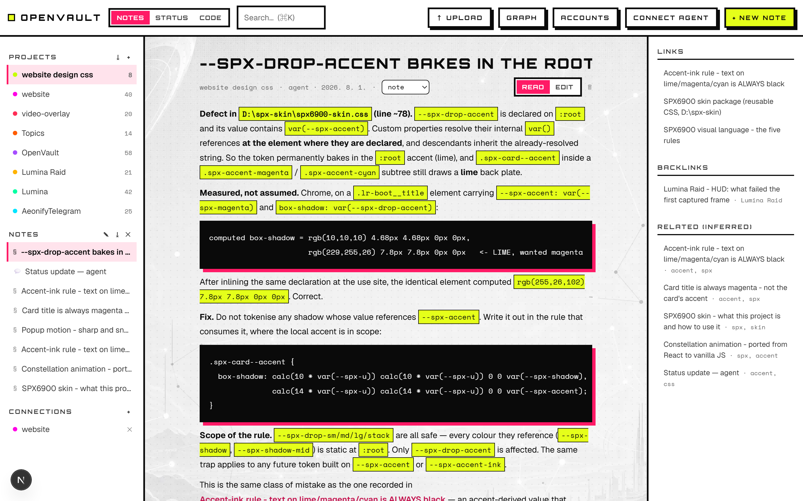
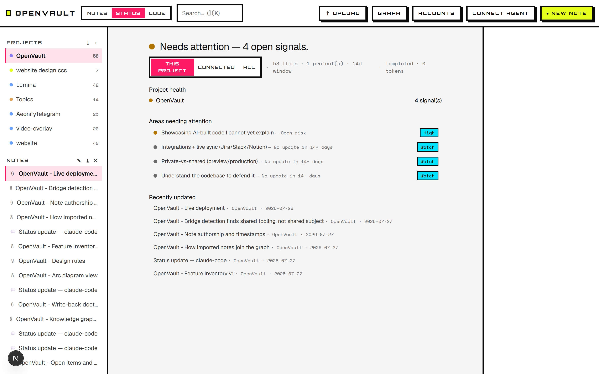
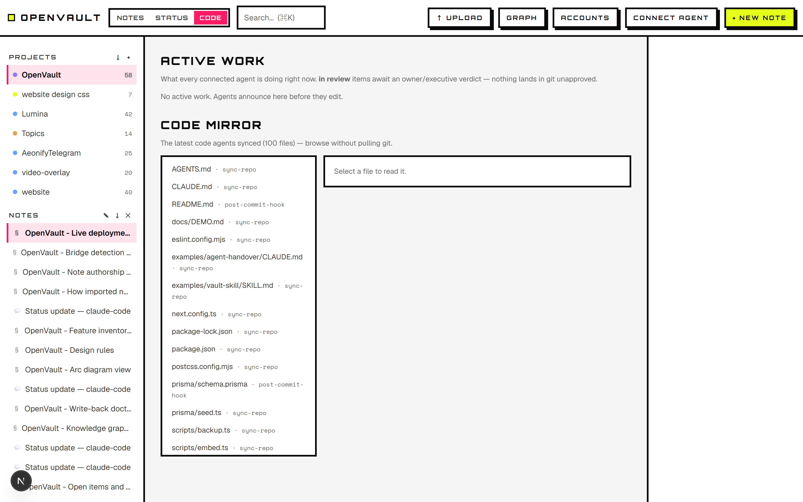
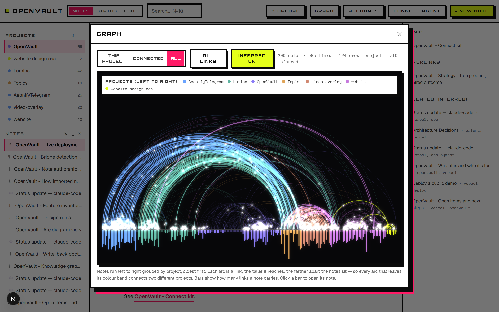

# OpenVault

A self-hosted project hub that you and your AI agents share over MCP. One agent writes down a status or raises a blocker. The next agent, cold, on another machine in another repo, reads it and picks up the work. You never relay the message.


The same eight steps in 3D, with the unit of work travelling through them, run at [/pipeline](https://openvault-hub.vercel.app/pipeline).

A live instance sits at [openvault-hub.vercel.app](https://openvault-hub.vercel.app), password-gated like every deployed vault.

Alone, it is the memory your agents keep between sessions: what you decided, what you rejected, and what the code looked like when you decided it. With other people, the same store becomes the coordination layer, because sharing the memory is the collaboration. Nobody posts a status update for anyone else to read.

## Quick start

Node 22 or newer.

```bash
git clone https://github.com/fangiskhan/openvault openvault
cd openvault
npm install
cp .env.example .env
npm run db:push
npm run dev
```

You get http://localhost:6900 backed by a SQLite file. Click **Load demo data** for three linked projects with a populated status board, or run `npm run db:seed`.

`npm run check` runs the typecheck, the linter, and 193 tests across 20 files. CI runs that same command on every push.

## Connect an agent

The in-app **Connect agent** button fills in your token and project ids. By hand:

```bash
claude mcp add --transport http openvault http://localhost:6900/api/mcp --header "Authorization: Bearer <ovk_ token>"
```

Drop the header when running locally with no `MCP_TOKEN`. The panel also carries the Codex form, which reads the token from an environment variable rather than a flag, and the Hermes form, which prompts for the token and keeps it in its own `.env`.

The server speaks MCP protocol `2025-06-18`, `2025-03-26` and `2024-11-05` over Streamable HTTP, echoing whichever version the client asks for. It runs single-response: there is no GET event stream, and a GET returns 405.

### The 48 tools

| Group | Tools |
| --- | --- |
| Read the project | `list_projects` · `get_status` · `get_attention` · `get_briefing` · `get_recent_activity` · `search` · `read_item` · `get_inbox` · `find_mcp` |
| Write the project | `set_status` · `append_update` · `flag_issue` · `request_info` · `import_notes` |
| Files | `upload_file` · `list_files` · `read_file` |
| Knowledge graph | `get_graph` · `get_links` · `find_path` · `suggest_links` · `find_project_bridges` |
| Code mirror | `get_code_map` · `read_code` · `search_code` · `sync_code` · `get_code_history` · `restore_code` · `set_mirror_mode` |
| Work board | `announce_work` · `get_active_work` · `update_work` · `review_work` |
| Suggested changes | `suggest_change` · `list_suggestions` · `get_suggestion` · `review_suggestion` · `withdraw_suggestion` |
| Project skills | `list_skills` · `get_skill` · `set_skill` · `delete_skill` |
| Identity and admin | `whoami` · `list_pending_accounts` · `approve_account` · `appoint_executive` · `register_mcp` |
| Destructive, owner or executive only | `delete_item` |

Every write records the authenticated account. When a caller sends an `actor` string, the server uses it only if no account is attached to the request.

You add content through the Upload and New note buttons; agents do the same over MCP with `upload_file` and `import_notes`.

## Two agents, one repo

Your colleague connects their agent. Without a shared layer, each agent re-pulls GitHub to see the code, and neither knows the other is editing the same file.

1. Before editing, an agent calls `announce_work` with its intent and file paths. The reply names anyone else whose active intent touches those paths.
2. `get_active_work` shows who is working on what, including the review queue.
3. After editing, the agent calls `sync_code` with the changed files and sets its intent to `in_review`.
4. An owner or executive reads the synced files and calls `review_work`. Approval clears the actor to push. A member cannot approve their own work, though an owner or executive can.
5. Any agent reads current code through `get_code_map`, `search_code` and `read_code` without a git pull.

### Suggested changes: the route for someone who cannot push

A collaborator with no git access, or any agent on a replica-mode mirror, proposes content-anchored edits ("replace this exact text with that") plus a reason. The server checks that each anchor occurs exactly once in the current file, so it refuses a stale or ambiguous proposal at filing time rather than misapplying it later. You approve, and you get the resulting file to apply in your own checkout.

**The vault stores no git credential.** Nothing lands in your repo that you did not approve and push yourself. The reason becomes a linked note, so why a change happened outlives the review.

Edits, new files (large ones split across several parts) and deletions all travel through the queue, so a refactor's removals get reviewed alongside its additions. An author can withdraw an open proposal, and an owner or executive can retract a mistaken note with `delete_item`. Both actions are audited.

Two scripts turn this into a normal editing loop. `scripts/checkout-mirror.ts` materialises the mirror to a local directory so an agent edits real files with its own tools, and `scripts/propose-changes.ts` diffs that working copy against its pristine base and files every change as anchored suggestions. It wants a `--reason` of at least ten characters and will not run without one.

## The code mirror

Each project carries a mirror of its source, so agents read current code without cloning. Paths are checked against traversal. One sync takes up to 100 files. Anything over 200,000 characters is stored in chunks and rejoined on read; anything over 4,000,000 characters is skipped and named in the response.

**Concurrent writes do not silently win.** Pass the `baseHash` that `read_code` gave you, and a push that would land on top of someone else's newer version is refused and reported, naming who changed it. Omitting `baseHash` on a path already in the mirror is refused too, so this is the default rather than something you opt into.

The last ten superseded versions of each path are kept. `get_code_history` lists them with previews, `restore_code` puts one back, and restoring is itself undoable. Two limits worth knowing: `restore_code` refuses on a replica mirror, where git is the history, and `npm run db:backup` snapshots the mirror's current files but not their version history.

The mirror is not a version control system. Git is where branching and merging belong.

### Point the mirror at git

A mirror written per-file, by whoever last committed, drifts into a mix of versions that never coexisted in the repo. An agent reading two files there is reading a tree you could not build.

Set `mirrorMode: "replica"` with `set_mirror_mode` and install the GitHub Action from the **Connect agent** panel. CI then syncs the whole tree plus deletions on every push to the default branch, so the mirror always equals one commit. Only the CI account may write it, and `get_code_map` reports `consistent` plus the ref breakdown. That write guard compares the authenticated account, so it holds on any vault with `MCP_TOKEN` or per-account tokens set; on a credential-free instance the actor is self-declared and the guard is advisory.

`"workspace"` mode keeps the mirror directly writable, which is right for projects with no git remote.

To mirror an existing repo once, run `npx tsx scripts/sync-repo.ts <dir> <projectName> [vaultUrl]`. It prefers `git ls-files`, walks the tree with excludes where it cannot, and refuses to upload `.env` files. `npm run sync:install` adds a post-commit hook that keeps it current.

## What you get

- Projects with connections. Rename, export and delete from the sidebar.
- Markdown notes with `[[wikilinks]]` and backlinks, plus an arc diagram of the whole vault: notes run left to right grouped by project, so every arc leaving its colour band is a cross-project link. Toggle the inferred layer to see the links nobody drew.
- Ranked search. The query is tokenized and results rank by how many terms a note covers, so "why no server-side AI" finds the note that answers it. `"Quoted"` queries stay literal. Pass a `projectId` to scope it: with no `projectId`, `scope: "project"` searches the whole vault.
- A rules engine that flags overdue, blocked, open-risk, due-soon and stale items, cites each one to its source item, and rolls them into a per-project RAG status. Where your manual override disagrees with the computed health, the Status tab shows both.
- A one-screen briefing built from real items, each line linking to its source. Templated rules, no model calls. Your connected agent supplies the prose.
- Document and image upload, extracted into searchable text: PDF, DOCX, PPTX, XLSX/CSV, TXT/MD, and PNG, JPEG, WebP and GIF. Node's `zlib` opens both ZIP archives and PDF content streams, so PDF, DOCX and PPTX need no parser library; XLSX goes through exceljs. Where a PDF's `/ToUnicode` tables do not resolve, the upload says so rather than storing glyph indices that look like text, and scanned PDFs are reported as needing OCR. `read_file` returns an image as an image, so an agent can look at a screenshot instead of reading about one.
- Bulk ingestion. Your agent splits a transcript or export into atomic notes and calls `import_notes`, and the server builds the Map-of-Content, the cross-links and the graph.
- Inferred connections. The Related rail and `suggest_links` surface notes that share content but were never linked, and `find_project_bridges` proposes project pairs. Every suggestion ships with the terms behind it, because the matching is lexical: two unrelated projects that both hit the same library error will score, and the evidence is how you tell that from real overlap.
- Accounts with owner, executive and member roles. Tokens are stored as SHA-256 hashes and shown once.
- Project skills. Record a convention with `set_skill` and the next agent to connect inherits it through `list_skills` and the session-start briefing, so the conventions live with the project rather than on one laptop.
- An optional `PostToolUse` hook that records which files a session touched, giving the vault a factual trail when an agent forgets to write a handover. It stores repo-relative filenames, an actor and a timestamp, never file contents and never your directory layout.
- `POST /api/ingest` for webhooks. A repeated `sourceRef` updates its item instead of duplicating it.
- Rate limits on sign-in, registration, MCP and ingest. `npm run db:backup` writes timestamped JSON snapshots.

Two places where the UI and the MCP surface differ: `get_graph` returns topic clusters to agents, while the browser's Graph view groups by project. And spreadsheet cells land in item metadata, where the UI renders them but search and `read_file` do not reach, so an XLSX is findable by its filename and sheet names rather than its contents.









## Accounts, and what roles do not do

1. Sign in with `APP_PASSWORD` (set it in `.env`) and open Accounts.
2. Add a member. The token appears once. Hand it over, and if they lose it click New Token, which stops the old one working immediately.
3. Approve the account. Until you do, its token does nothing.
4. They connect with `Authorization: Bearer ovk_...`, and every write they make carries their name.
5. Appoint executives to approve accounts and review work.

Self-registration works through `POST /api/accounts`, and accounts start pending. The owner username (`OWNER_USERNAME`, default `owner`) is reserved.

Read the next paragraph before you put two clients in one vault.

**OpenVault is single-tenant, and roles gate writes rather than reads.** Any approved account, the shared `MCP_TOKEN`, or an `APP_PASSWORD` session reads every project, note, upload and mirrored file in the vault. There is no per-project membership table. Roles decide who approves accounts, reviews work, changes roles and deletes items. A member who signs in to the web UI can also create, edit and delete notes and projects, and export the whole vault; what their session cannot do is approve accounts, change roles or review work. An executive can re-issue any account's token, including the owner's. Run one vault per client where engagements must not see each other.

Security in v1: tokens hashed at rest (SHA-256 of 192-bit random keys) · constant-time compare on the shared token · an owner bootstrap nobody can squat · rate limits on sign-in, registration, MCP and ingest · upload filename sanitization, storage-root confinement and size caps · an append-only audit of registrations, approvals, role changes, token regenerations, per-account logins, ingests, syncs, announcements, proposals and reviews. Append-only holds by convention in the code rather than by a database constraint, and signing in with `APP_PASSWORD` writes no audit row.

## The daily loop

Download the per-project files from the **Connect agent** panel and the loop runs without anyone remembering it.

- `CLAUDE.md` at the repo root tells each session to read state first, announce before editing, sync and submit for review after, and log a handover.
- A `.claude/settings.json` hook curls `GET /api/brief/<projectId>` at session start, so the briefing lands in context before you type. The same `curl` works on Windows and unix.
- A `post-commit` git hook syncs each commit's changed files into the mirror.
- The vault-ingest skill teaches any agent to split a transcript or export into atomic linked notes. The instructions live on your server; the splitting runs on the visitor's agent.
- A global `CLAUDE.md` puts the vault-first rule into every session on your machine: search the vault before asking, admit "no record" instead of guessing, write back what you learn. The MCP server sends the same steering at connect time, so the file only makes it stick across other surfaces. Connecting never edits anyone's files, because a server that could rewrite a client's standing orders would be an injection hole.

For "what did everyone's agents do since yesterday", `get_recent_activity` returns each item, work intent and audit action from the last N hours, grouped and attributed.

## Optional: semantic search

Lexical ranking is the default because it costs nothing, needs no model, and reproduces. Its limit is that it cannot tell *about the same thing* from *shares rare words*, the same limit that makes `find_project_bridges` score two projects that both hit an `httpx` error.

Point OpenVault at any OpenAI-compatible embeddings endpoint and search blends meaning with wording. A local Ollama keeps it free and private.

```bash
# .env
EMBEDDING_URL="http://localhost:11434/v1/embeddings"   # or https://api.openai.com/v1/embeddings
EMBEDDING_MODEL="nomic-embed-text"                      # or text-embedding-3-small
# EMBEDDING_KEY="sk-..."                                # omit for a local endpoint
```

```bash
npm run embed     # embeds only notes whose text changed since last time
```

Results then rank on both signals, and every hit carries its `semantic` score so you can see which layer found it. Set both `EMBEDDING_URL` and `EMBEDDING_MODEL` or the layer stays off. If the endpoint is down, search falls back to lexical.

## What it costs, measured

Run `node scripts/measure-context.mjs` and `node scripts/benchmark-retrieval.mjs` yourself. Both print their own numbers, and both move as the repo grows. The figures below come from a run on 2026-09-06 against the live vault at openvault-hub.vercel.app, whose OpenVault project holds 130 mirrored files and 32 notes. Tokens are characters divided by four.

| Call | Tokens |
| --- | --- |
| `get_briefing` | 155 |
| `get_code_map`, 130 files | 9,036 |
| Reading every mirrored file | 296,192 |
| `get_recent_activity`, 7 days | 804 |
| One `search` plus the note it cites | 2,505 |
| The 48 tool schemas, loaded at connect | 7,615 |

Read that table with these in mind:

- The script prints those six figures. It does not measure the cold path, so any "without the vault" comparison is my arithmetic rather than its output.
- **The code-map row is the one most likely to be misread.** `get_code_map` returns paths, hashes and sizes, and no source. It makes *detecting* change cheap; it does not compress code. A task that needs 250k tokens of source still costs 250k.
- The 7,615-token schema overhead is paid whether or not a tool gets called. The average mirrored file is 2,278 tokens, so about three and a half avoided file-reads repay it.
- The briefing and the activity digest scale with how much is open, which makes them the least stable rows. The digest has measured 804, 1,253 and 4,994 tokens at three points in this project's life.
- The whole-mirror figure sums stored file sizes, so it understates what reading them through `read_code` costs.
- Savings depend on the agent asking the vault before grepping. The connect-kit `CLAUDE.md` tells it to.

### The same question, with and without the vault

`scripts/benchmark-retrieval.mjs` asks four questions about this repo and measures the tokens each side must pull into context, then checks mechanically whether the retrieved bytes contain the answer.

The method:

- **With vault**: one `search`, then `read_item` on the top hit and up to two notes it wikilinks.
- **Without**: grep the repo for the question's terms, then read around the hits. Reported as a range, because the result depends on how well the agent guesses. Best case is grep output plus one read window in the file grep hit hardest; worst case is a window at every match in every file.
- **Corpus**: `git ls-files`, minus binaries and lockfiles. An early run was dominated by `tsconfig.tsbuildinfo`, a 250 KB build artifact stored as one line, where a single grep hit produced a 62,000-token window. The script also excludes itself and this README, both of which contain the terms it greps for.
- **Coverage**: each question declares terms a correct answer must contain. For the cold side the script checks them against every file grep matched, read in full, which is more generous than the windows it charged for.

| Question | With vault | Without, best..worst | Answer present |
| --- | --- | --- | --- |
| Why promote from claude-mem instead of capturing sessions automatically? | 3,288 | 986 .. 986 | vault 3/3, code 1/3 |
| How is a Claude Code project's history turned into notes? | 2,624 | 1,272 .. 4,306 | vault 2/3, code 3/3 |
| Why does the vault never write to git? | 3,402 | 6,729 .. 24,802 | vault 3/3, code 3/3 |
| What exactly does `get_code_map` return? | 2,817 | 5,244 .. 26,934 | vault 3/3, code 3/3 |

The vault loses two of the four rows.

- Row 2 it loses outright, on price and on completeness. The source answers "how does this work", and a note repeating it goes stale on the next commit.
- Row 1 it wins by not being comparable. The cold path is 3.3x cheaper and returns almost nothing, because `claude-mem` appears in no implementation file, and neither do the rejected alternatives or the constraint that Vercel cannot read a developer's local store.
- Rows 3 and 4: the vault is about 2x cheaper than the cold path's best case, and both sides reach the answer.

Code records what got built, not what got considered and dropped. A decision and the alternative it beat live only in the notes, while implementation detail lives in both. Write notes about the first and you hold the only copy. Write notes about the second and you maintain a second copy that drifts.

This measures retrieval cost: the bytes that must enter context. It is not end-to-end agent cost, which needs API-level usage accounting rather than an agent's self-report. Not built.

One earlier version of this table was measured against a corpus that included this README, which by then reprinted the benchmark's questions, its answer terms and its results. Row 1 read "code 3/3" as a result. The script had already excluded itself for that exact reason, and the document that reprints it needed the same guard.

## Deploy to Vercel

Local dev stays on SQLite and deploys use Postgres. The `vercel-build` script generates the Postgres schema, provisions tables with `prisma db push` over the unpooled URL, and builds, so you do not edit `schema.prisma` or run migrations by hand. Leave `schema.prisma` on the sqlite provider, because `scripts/make-postgres-schema.mjs` refuses to run otherwise. (Comments in `.env.example` and `prisma/schema.prisma` still tell you to switch the provider by hand. They are stale, and following them fails the build.)

1. Link the repo with `npx vercel link`, or import it in the dashboard.
2. In Storage, create a Neon Postgres and connect it. Vercel injects `DATABASE_URL` and its variants as write-only values, and the build reads them from Vercel's environment.
3. Set `APP_PASSWORD`, `AUTH_SECRET` and `MCP_TOKEN` for Production. Piping into `vercel env add` on Windows leaves a trailing newline, which fails comparison at runtime.
4. Deploy with `npx vercel --prod`.

Uploads work with no extra configuration: on Vercel the default driver stores bytes in the database, up to `DB_BLOB_MAX_BYTES` (8 MB), though Vercel's 4.5 MB request-body cap bites first. Create a Blob store and set `STORAGE_DRIVER=vercel` plus `BLOB_READ_WRITE_TOKEN` when you outgrow that.

If your production URL asks for Vercel SSO, switch Deployment Protection off or scope it to previews. OpenVault carries its own password gate.

Vercel Hobby is non-commercial under Vercel's terms. Companies need Pro, or should self-host.

## Self-host

A normal Next.js app. 1-2 vCPU and 1-4 GB RAM suffice, and a Raspberry Pi 4 handles single-user. The AI runs client-side in Claude Code or Cursor, so the server needs no GPU.

```bash
npm install && npm run db:push && npm run build && npm run start
```

Keep SQLite or point `DATABASE_URL` at Postgres.

## Configuration

| Variable | Purpose |
| --- | --- |
| `DATABASE_URL` | SQLite file (`file:./dev.db`) locally, or a Postgres URL |
| `DATABASE_URL_UNPOOLED` | Direct connection used for DDL during `vercel-build` |
| `APP_PASSWORD` | Human login gate. Leave it empty on localhost only. |
| `AUTH_SECRET` | HMAC secret for the session cookie. A known value lets anyone forge sessions. |
| `MCP_TOKEN` | Shared bearer token for `/api/mcp`, resolving to the owner. Per-account `ovk_` tokens beat it for teams. |
| `OWNER_USERNAME` | Root owner account (default `owner`). Reserved. |
| `OPENVAULT_PUBLIC` | Set to `1` to run with open gates in production on purpose. |
| `OPENVAULT_DEMO` | Set to `1` for a public read-only demo: anyone reads, and the server refuses every write. Point it at demo data, since readers see all of it. |
| `STORAGE_DRIVER` | `local` (uploads go to `./storage`), `db` (bytes in the row, capped by `DB_BLOB_MAX_BYTES`) or `vercel` (Blob). Unset, it picks `db` on Vercel and `local` elsewhere. |
| `DB_BLOB_MAX_BYTES` | Ceiling for the `db` driver (default 8 MB) |
| `BLOB_READ_WRITE_TOKEN` | Required when `STORAGE_DRIVER=vercel` |
| `EMBEDDING_URL`, `EMBEDDING_MODEL` | Turn on semantic search. Set both or the layer stays off. |
| `EMBEDDING_KEY` | Omit for a local endpoint |
| `PRISMA_ACCEPT_DATA_LOSS` | One-deploy escape hatch for a destructive schema change |

A production server refuses to start when `APP_PASSWORD`, `AUTH_SECRET` or `MCP_TOKEN` is empty or left at a placeholder, so an exposed instance cannot run with the UI and the MCP write endpoint open. `npm run dev` skips that check, because the zero-config localhost loop needs no secrets. To run open in production on a trusted LAN, or as a public read-only demo, set `OPENVAULT_PUBLIC=1` and the server logs a warning at boot instead.

The bundled scripts read three more variables on *your* machine rather than the server's: `OPENVAULT_URL`, `OPENVAULT_PROJECT` and `OPENVAULT_TOKEN`, needed by `sync-repo`, `checkout-mirror` and `propose-changes` against any secured vault.

## Not built

- Native adapters for Jira, Slack and Notion. The webhook foundation runs today through `POST /api/ingest`, but per-service adapters with OAuth and field mapping do not exist. Realtime browser updates are unbuilt too.
- A private draft space over the shared source of truth, with selective publish.
- SSO, a read ACL, and browser-level end-to-end tests.

## Tech stack

Next.js 16 (App Router) · React 19 · TypeScript · Prisma 6 (SQLite / Postgres) · Tailwind v4 · zod · exceljs · vitest. No Prisma enums, so one schema serves both databases.

## License

MIT
