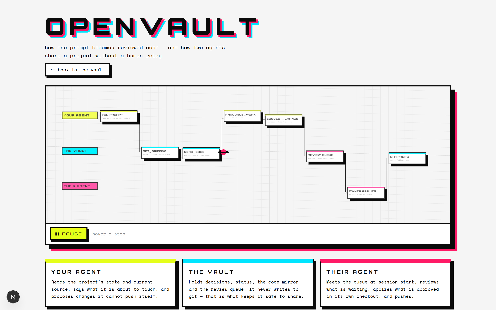

# OpenVault

A self-hosted project hub that your team and its AI agents share over MCP. An agent records a status, raises a blocker, or logs what it finished. The next agent, on another machine in another repo, reads that record and acts on it. Nobody relays anything.


There is a [live, interactive version of this diagram](https://openvault-hub.vercel.app/pipeline) — the same pipeline in 3D, with the unit of work travelling through it.

A concrete run: your agent finishes a task and files a cross-project blocker. Your colleague's agent starts cold an hour later, calls `get_attention`, sees the blocker with the error text and the project it belongs to, and picks it up. You and your colleague never spoke.

A live instance runs at [openvault-hub.vercel.app](https://openvault-hub.vercel.app) (password-gated, as every deployed vault is). Self-hosting your own takes about five minutes; see [Quick start](#quick-start-local).

Notes, tasks, risks, meeting minutes and spreadsheets live inside projects. Connect two projects and wikilinks, search and the graph cross the boundary. Each project also carries a code mirror and a work board, so agents read current code and see each other's in-flight changes without pulling GitHub. Run it on your own machine, your own server, or Vercel. Your data stays where you put it.

Working v1: projects, status, cited briefings, multi-user accounts with roles and approval, tokens hashed at rest, an append-only audit trail, JSON export, and 48 MCP tools for reading and writing state, code, and coordination. 178 automated tests cover the rules engine, the similarity engine, the code mirror's concurrency and recoverability, and the auth/review safety core. Jira/Slack/Notion adapters, draft workspaces, and realtime push remain on the [roadmap](#roadmap).

## What it looks like

The vault at rest — projects on the left, the note you are reading in the middle, and the links, backlinks and inferred connections it already has on the right.


The attention board. Every row cites the item that triggered it, so a status is never an opinion — it is a claim you can open.


The code mirror and the review queue: what agents can read without cloning, and what is waiting on a human verdict.


The whole vault as an arc diagram. Notes run left to right grouped by project, so every arc that leaves its colour band is a cross-project connection.


## Who uses it

- Consultants: one project per client engagement, with its meetings, decisions, risks and status in one place. Self-host so client data never leaves your infrastructure.
- Finance teams: track deal workstreams, drop in Excel models (parsed and searchable), keep a RAG status per project.
- Project managers: upload meeting minutes, read a one-screen briefing instead of pinging five people.
- Developers running agents: Claude Code, Cursor and Codex read project status and code, announce what they plan to change, and write back what they did. The next session starts informed.

## What works today

- Projects with connections; rename, export and delete from the sidebar
- Markdown notes with `[[wikilinks]]`, backlinks, and an **arc diagram** of the whole vault: notes run left to right grouped by project and ordered by age, so every arc that leaves its colour band is a cross-project connection. Toggle the inferred layer to see the links nobody drew.
- Ranked search scoped to one project, connected projects, or the whole vault. Ask in natural language: the query is tokenized and results rank by how many terms a note covers, so "why no server-side AI" finds the note that answers it. `"Quoted"` queries stay literal. Optionally blend in **semantic search** (below) to also find notes that share meaning but none of the words.
- Automatic capture: an optional `PostToolUse` hook records which files a session touched, so the vault has a factual trail even when an agent forgets to write a handover. Filenames and tool names only — never file contents or command output, and paths are stored repo-relative so a shared vault never learns anyone's directory layout. It is two files from the connect kit, not one: the hook entry runs `.claude/openvault-activity.mjs`, because Claude Code hands a hook its tool call as JSON on stdin and exposes no `$CLAUDE_TOOL_*` variables for a bare `curl` to read.
- **Document and image upload, extracted into searchable text.** PDF, DOCX, PPTX, XLSX/CSV, TXT/MD and images (PNG, JPEG, WebP, GIF). The extracted text becomes the item body, so search finds a phrase inside a slide deck rather than only its filename. Dependency-free: Office files are ZIP archives of XML and PDF text lives in compressed content streams, both of which Node's `zlib` already opens. PDFs decode through their `/ToUnicode` tables where those resolve; where they do not, the upload **says so** instead of storing glyph indices that merely look like text — one real PDF produced `"! ,0++.-*(&*)`, and putting that into search results would be worse than storing nothing. Scanned PDFs are reported as needing OCR. `list_files` and `read_file` give agents access, and `read_file` returns an **image as an image**, so an agent can look at a screenshot rather than be told about one.
- A rules engine that flags overdue, blocked, open-risk, due-soon and stale items, cites each one to its source item, and rolls them into a per-project RAG status
- A one-screen briefing built from real items; each line links to its source
- 48 MCP tools (table below)
- An interactive [3D pipeline page](https://openvault-hub.vercel.app/pipeline) at `/pipeline` — the loop as three swim lanes with the unit of work travelling through it. three.js is imported only by that route, so the vault itself never pays for it.


- **Suggested changes** — the route for someone who can't write the code: a collaborator with no git access, or any agent on a replica-mode mirror. They propose content-anchored edits ("replace this exact text with that") plus a required reason; the server verifies each anchor occurs exactly once in the current file, so a stale or ambiguous suggestion is refused at proposal time rather than misapplied later. An owner approves, and gets the resulting file to apply in their own checkout. **The vault never writes to git** — no stored credential, no merge engine, nothing lands that a human didn't approve on their own machine. The reason becomes a linked note, so why a change happened outlives the review that a pull-request description would have taken with it. A working-copy flow ships with it: `scripts/checkout-mirror.ts` materialises the mirror to a local directory so an agent edits real files with its native tools instead of windowed `read_code` calls, and `scripts/propose-changes.ts` diffs the working copy against its pristine base and files every change as anchored suggestions automatically. All three change types travel through the queue — edits, new files (large ones as multi-part proposals), and deletions, so a refactor's removals get reviewed with its additions instead of riding along in prose. A mistaken proposal can be withdrawn by its author, and a mistaken note retracted with `delete_item` — both audited, because taking something back is itself a fact worth keeping.
- Bulk ingestion: your agent splits a transcript, doc, or export into atomic notes (the downloadable vault-ingest skill teaches it how) and calls `import_notes`; the server builds the Map-of-Content, cross-links, and graph
- Inferred connections: the Related rail and `suggest_links` surface notes that share content but were never linked; `find_project_bridges` proposes candidate project pairs; the graph groups notes into topic clusters. Every suggestion ships with the terms behind it, because the matching is lexical rather than semantic — two unrelated projects that both hit the same library error will score, and the evidence is how you tell that apart from real overlap in seconds.
- A code mirror and work board per project, with conflict warnings before two agents touch the same file
- Accounts with owner, executive and member roles; tokens stored as SHA-256 hashes and shown once; per-account web login; an audit trail of approvals, role changes, logins and agent writes
- A Code tab where owners and executives approve or reject in-review work
- `POST /api/ingest` for webhooks (Jira automation, Slack workflows, GitHub Actions, Zapier); a repeated `sourceRef` updates its item instead of duplicating it
- Rate limits on sign-in, registration, MCP and ingest; `npm run db:backup` writes timestamped JSON snapshots
- First-run onboarding: create a project, load demo data, or connect an agent

## Status and briefings

The Status tab shows a RAG headline, per-project health, an attention board where each row cites the item that triggered it, and recent decisions and updates. The computed health sits next to your manual override; when they disagree, the UI flags the divergence instead of hiding it.

The briefing is templated and deterministic: rules over your items, no model calls, no inference server. Your connected agent supplies the prose. Ask Claude Code to narrate `get_briefing` and you get a written, cited summary for the cost of your own agent's tokens.

## Connect an agent

The in-app Connect agent button fills this in for you, or run:

```bash
claude mcp add --transport http openvault http://localhost:6900/api/mcp \
  --header "Authorization: Bearer <your ovk_ account token or MCP_TOKEN>"
```

Drop the `--header` for open local use with no `MCP_TOKEN` set.

| Group | Tools |
| --- | --- |
| Read | `list_projects` · `get_status` · `get_attention` · `get_briefing` · `get_recent_activity` · `search` · `read_item` · `get_inbox` |
| Knowledge graph | `get_graph` · `get_links` · `find_path` · `suggest_links` · `find_project_bridges` |
| Write (attributed) | `set_status` · `append_update` · `flag_issue` · `request_info` · `import_notes` (bulk: atomic notes + Map-of-Content + auto cross-links in one call) |
| Code and coordination | `announce_work` · `get_active_work` · `update_work` · `review_work` · `sync_code` · `get_code_map` · `read_code` · `search_code` |
| Project skills | `list_skills` · `get_skill` · `set_skill` · `delete_skill` |
| Identity and admin | `whoami` · `list_pending_accounts` · `approve_account` · `appoint_executive` · `register_mcp` · `find_mcp` |

Humans add content through the Upload and New note buttons. Agents never touch those; they read and write over MCP.

## Skills travel with the project

A project can carry its own working conventions — how its tests run, what its review checks, which traps to avoid — and any agent that connects inherits them. Record one with `set_skill`; it shows up in `list_skills` and, more usefully, in the **session-start briefing the hook already injects**, so the next agent reads the project's rules before it does anything. No install, no per-machine setup: the conventions live with the project rather than on one person's laptop.

Anyone who prefers a real slash-command can download a skill as a `SKILL.md` for `~/.claude/skills/<name>/`, but that's optional — agents read them in-session over MCP.

## How agents share code

You connect your agent. Your colleague connects theirs. Without a shared layer, each one re-pulls GitHub to see the code and neither knows the other is editing the same file.

With the vault:

1. Before editing, an agent calls `announce_work` with its intent and the file paths. The response lists any active intents from other agents that touch the same paths, by name.
2. `get_active_work` shows who is working on what across the project, including the review queue.
3. After editing, the agent calls `sync_code` with the changed files (it diffs against `get_code_map` hashes first) and sets its intent to `in_review`.
4. An owner or executive reads the synced files and calls `review_work`. Approval marks the work done and clears the actor to push to git. Request-changes sends it back with a note. A member cannot mark their own work done; the server rejects the attempt.
5. Any agent reads current code through `get_code_map`, `search_code` and `read_code` without a git pull.

Each write carries the account or declared actor and lands in the audit log. Paths are validated against traversal; files larger than 200k characters are chunked and rejoined on read, 100 files per sync. The vault holds the merge decision and its provenance. Git performs the merge, and the server never holds your GitHub credentials.

**Concurrent writes don't silently win.** The mirror holds one version per path, so two agents editing the same file could once overwrite each other without a word. Pass `baseHash` — the hash `read_code` gave you before editing — and a push that would land on top of someone else's newer version is **refused and reported** instead, naming who changed it and what to merge. Every superseded version is kept regardless: `get_code_history` shows them with previews, `restore_code` puts one back, and restoring is itself undoable. `npm run db:backup` includes the mirror.

The mirror is not a version control system and shouldn't become one — git is where branching and merging belong.

### Point the mirror at git (recommended for any repo with a remote)

A mirror written per-file, by whoever happened to commit, drifts into something worse than stale: a mix of versions that **never coexisted in the repo**. This project's own mirror reached 104 files across 4 commits before anything noticed. An agent reading two files there is reading a tree you could not build.

Set `mirrorMode: "replica"` (via the `set_mirror_mode` tool) and install the GitHub Action from the **Connect agent** modal. Then:

- CI syncs the **whole tree plus deletions** on every push to the default branch, so the mirror always equals exactly one commit
- Only the CI account may write it — everyone else is refused with a pointer to open a PR, so **mirror-only work cannot exist**, which retires the whole class of losing it
- `get_code_map` reports `consistent`, the ref breakdown, and warns loudly if the mirror ever spans several commits again

`"workspace"` mode keeps the mirror directly writable and remains correct for projects with **no git remote** — those would otherwise lose their mirror entirely.

The guarantee in workspace mode stays narrower but firm: **nothing you put in it disappears without a trace.**

To mirror an existing repo in one shot, run `npx tsx scripts/sync-repo.ts <dir> <projectName> [vaultUrl]`. It uses `git ls-files` where it can, walks the tree with sane excludes where it can't, and refuses to upload `.env` files. Pair it with the post-commit hook and the mirror stays current from then on.

Retrieval is blind-tested: an agent with no prior context, given only two questions about a mirrored project, read the source through the vault, answered both with file-level citations, and caught a factual error in a hand-written vault note by checking it against the code. Notes can be wrong; the mirrored source corrects them.

## The daily loop

Download three files per project from the Connect agent modal (plus a vault-wide ingest skill, below) and the loop runs without anyone remembering it:

- `CLAUDE.md` (repo root) tells each agent session to read state first, announce before editing, sync and submit for review after, and log a handover.
- A `.claude/settings.json` hook curls `GET /api/brief/<projectId>` at session start. The plain-text briefing (headline, attention, active work, recent changes) lands in the session's context before you type. The same `curl` works on Windows and unix.
- A `post-commit` git hook syncs each commit's changed files into the code mirror, attributed to `post-commit-hook`.
- The vault-ingest skill (`/api/connect-kit?file=ingest-skill`, saved to `~/.claude/skills/vault-ingest/`) teaches any agent to split a transcript, doc, or export into atomic linked notes and call `import_notes`. The instructions live on your server; the splitting runs on the visitor's agent.
- A global `CLAUDE.md` download (`/api/connect-kit?file=global-claude`, saved to `~/.claude/CLAUDE.md`) puts the vault-first rule into every session on your machine, any folder: search the vault before asking the human, admit "no record" instead of guessing, write back what you learn. The MCP server also sends this steering in its connect-time instructions, so connected agents get the rule even without the file; the file makes it stick across every surface. Connecting never modifies anyone's files: a server that could silently edit a client's standing orders would be an injection hole, so placing the file stays a human choice.

For "what did everyone's agents do since yesterday", `get_recent_activity` returns each item, work intent and audit action from the last N hours, grouped and attributed.

## Optional: semantic search

Lexical ranking is the default because it costs nothing, needs no model, and is reproducible. It has one real limit: it cannot tell *about the same thing* from *shares rare words* — the same limit that makes `find_project_bridges` score two unrelated projects that both hit an `httpx` error.

Point OpenVault at any OpenAI-compatible embeddings endpoint and search blends meaning with wording. A local Ollama keeps it free and private:

```bash
# .env
EMBEDDING_URL="http://localhost:11434/v1/embeddings"   # or https://api.openai.com/v1/embeddings
EMBEDDING_MODEL="nomic-embed-text"                      # or text-embedding-3-small
# EMBEDDING_KEY="sk-..."                                # omit for a local endpoint
```

```bash
npm run embed     # embeds only notes whose text changed since last time
```

Results then rank on both signals (lexical leads; semantic surfaces notes that share no words with your question), and every hit carries its `semantic` score so you can see which layer found it. Leave the variables unset and nothing changes — no calls, no cost, no behaviour difference. If the endpoint is down, search silently falls back to lexical rather than failing.

## Token cost, measured

Measured against this project's own live vault — 116 mirrored files, 28 notes on OpenVault (87 across all projects) — by `node scripts/measure-context.mjs`, which prints this table. Re-run it rather than trusting it; these numbers move as the repo grows. Tokens are characters ÷ 4.

| Question | Without the vault | With the vault |
| --- | --- | --- |
| What's the state of this project? | Re-explore the repo and history each cold start (est. 20-50k tokens) | 438-token briefing, injected by the hook |
| *Which files* changed in the code? | Read the mirror's contents: 268,326 tokens | `get_code_map`: 8,066 tokens of paths, sizes and content hashes — then read only what moved |
| What happened this week? | Scroll transcripts | 7-day `get_recent_activity` digest: 4,994 tokens |
| What did we decide about X? | Re-read history | One `search` plus the note it cites: 2,683 tokens |

The briefing costs zero LLM tokens to produce (templated rules) and the inferred-connections layer runs on TF-IDF, so building and maintaining the knowledge layer costs no model calls either.

Fine print, because a table of numbers invites more trust than it has earned:

- Connecting the MCP server loads 48 tool schemas into every session — a measured 7,615 tokens of overhead, paid whether or not a tool is called. Two avoided file-reads repay it.
- **The code-map ratio is not a general discount, and it is the row most likely to be misread.** `get_code_map` returns paths, hashes and sizes — *no source*. It makes **detecting** change cheap; it does not compress code. A task that genuinely requires reading 250k tokens of source still costs 250k. Measured on this repo: 66 of its 117 files changed in the last seven days, and reading those is 249,660 tokens against 268,326 for everything — so on "what changed this week", the map's saving on the *reading* is close to nothing. Its saving is on the *search*: 8,066 tokens tells you exactly which files differ, by hash, with no false positives.
- The ratio is also a function of average file size rather than a constant — it was 14x when the mirror held 89 smaller files. A repo of many tiny files would score worse.
- **The savings that actually compound are the notes, not the mirror.** A 438-token briefing answers "where is this project" without re-deriving it, and one `search` plus its cited note (2,683 tokens) answers "why did we decide X" without re-reading the history that produced it. That is compression of *conclusions*, deliberately lossy, and it is where the leverage is.
- The activity digest scales with how much actually happened, so it is the least stable row here. The same call on the same vault measured 1,253 tokens at an earlier point in this project's life.
- The whole-mirror figure is the sum of stored file sizes, so it *understates* the real cost — reading those files through `read_code` also pays per-call envelope and headers.
- Savings depend on the agent asking the vault before grepping; the connect-kit `CLAUDE.md` instructs it to. On very large vaults, prefer `topLinked` and `get_links` over a full `get_graph`.
- The cold-start row is the one estimate left in the table. Instrumented side-by-side agent sessions are future work.

## Benchmark: the same question, with and without the vault

`node scripts/benchmark-retrieval.mjs` asks four real questions about this repo and measures what it costs to answer each one **from the vault** versus **from the code**, then checks whether the retrieved bytes actually contain the answer.

**The method**, stated because a benchmark whose rules are hidden is a marketing claim:

- **With vault** — one `search`, then `read_item` on the top hit and up to two notes it wikilinks. Not "read the whole vault".
- **Without vault** — grep the repo for the question's key terms, then read around the hits. Reported as a *range*, because the result depends entirely on how well the agent guesses: **best case** is grep output plus one read window in the file grep hit hardest; **worst case** is a window at every match in every file. The truth is in between and I refuse to pick a point in it, because picking one is how you tune a benchmark to the answer you want.
- **Corpus** — `git ls-files`, not a directory walk. An early run was dominated by `tsconfig.tsbuildinfo`, a 250 KB build artifact stored as one line, where a single grep hit produced a 62,000-token "window". The benchmark script also excludes itself, since it contains the very terms it greps for.
- **Coverage** — each question declares terms any correct answer must contain, checked mechanically against what each side retrieved. Choosing those terms is the one judgement call left, and it is in the source.

| Question | With vault | Without (best..worst) | Answer present? |
| --- | --- | --- | --- |
| Why promote from claude-mem instead of capturing sessions automatically? | 3,304 | 986 .. 986 | vault 3/3, **code 1/3** |
| How is a Claude Code project's history turned into notes? | 2,630 | **1,272** .. 4,283 | vault 2/3, **code 3/3** |
| Why does the vault never write to git? | 3,404 | 8,250 .. 29,682 | vault 3/3, code 3/3 |
| What exactly does `get_code_map` return? | 3,479 | 4,482 .. 30,154 | vault 3/3, code 3/3 |

**The vault loses two of these four, and that is the point.**

- **Row 2 it loses outright** — cheaper *and* more complete from the code. Correct: "how does this work" is a question the source answers definitively, and a note about it is a stale copy waiting to happen.
- **Row 1 it wins by not being comparable.** The cold path is 3.4x cheaper and returns almost nothing: `claude-mem` appears **nowhere** in the tracked source, nor do the rejected alternatives, the scoring, or the constraint that Vercel cannot read a developer's local store. Grep's two hits for "automatic capture" are a *different* feature — a PostToolUse activity hook — so the cheap path is not merely incomplete, it is actively misleading. Spending 986 tokens to be pointed at the wrong subsystem is not a saving.
- **Rows 3 and 4 are the honest middle**: the vault is 1.3–2.4x cheaper in the cold path's best case, and both sides reach the answer.

The shape of the result is the finding: **the vault wins on *why* and loses on *how*.** Decisions, rejected alternatives and the reasoning behind a constraint are never in the source, because code records what was built and not what was considered and discarded. Implementation detail always is. A vault that tries to duplicate the second category earns stale notes; one that captures the first is holding the only copy.

Caveat worth stating plainly: this measures **retrieval** cost — bytes that must enter context — not end-to-end agent cost. It excludes the model's own reasoning tokens and the number of turns taken. Measuring those honestly needs API-level usage accounting rather than an agent's self-report, and that is still future work.

## Accounts: the team walkthrough

1. Sign in with `APP_PASSWORD` and open Accounts.
2. Add a member. The account's token appears once; copy it and hand it to your teammate. If they lose it, click New Token, which revokes the old one at that moment.
3. Approve the account. Until then its token does nothing.
4. Your teammate connects their agent with `Authorization: Bearer ovk_…`. Every write they make carries their name in the audit trail. They can also sign in to the web UI with username plus token; the session carries member authority and nothing more.
5. Appoint executives if you want others to approve accounts and review work.

Self-registration works too (`POST /api/accounts`); accounts start pending and wait in the approval queue. The owner username (`OWNER_USERNAME`, default `owner`) is reserved; nobody can register it.

## Quick start (local)

Requires Node 20+.

```bash
git clone https://github.com/fangiskhan/openvault openvault
cd openvault
npm install
cp .env.example .env        # defaults work as-is for local use
npm run db:push             # create the SQLite database
npm run dev                 # http://localhost:6900
```

Local, offline, file-on-disk. On first run, click Load demo data for three linked projects with a live status board, or run `npm run db:seed`.

## Deploy to Vercel

Local dev stays on SQLite; deploys use Postgres. The `vercel-build` script generates the Postgres schema, provisions the tables (`prisma db push` over the unpooled URL), and builds, so you never edit `schema.prisma` or run migrations by hand.

1. Link the repo: `npx vercel link`, or import it in the Vercel dashboard.
2. In the project's Storage tab, create a Neon Postgres and connect it. Vercel injects `DATABASE_URL` and its variants; the values are write-only, which is fine because the build reads them where they live.
3. Set `APP_PASSWORD`, `AUTH_SECRET` and `MCP_TOKEN` for Production. If you add them by piping into `vercel env add` on Windows, strip the trailing newline first or the values will fail comparison at runtime.
4. Deploy: `npx vercel --prod`.
5. If Vercel Authentication (Deployment Protection) wraps your production URL in Vercel SSO, switch it off or scope it to previews in Settings → Deployment Protection. The app carries its own password gate and refuses to boot open.
6. For uploads, create a Blob store and set `STORAGE_DRIVER=vercel` plus `BLOB_READ_WRITE_TOKEN`. Everything else works without it.

Vercel Hobby is non-commercial under Vercel's terms; companies need Pro or should self-host.

## Self-host

A normal Next.js app. 1-2 vCPU and 1-4 GB RAM suffice; a Raspberry Pi 4 handles single-user. The AI runs client-side in Claude Code or Cursor, so the server needs no GPU.

```bash
npm install && npm run db:push && npm run build && npm run start
```

Keep SQLite or point `DATABASE_URL` at Postgres. Production refuses to start until you set `APP_PASSWORD`, `AUTH_SECRET` and `MCP_TOKEN` (or set `OPENVAULT_PUBLIC=1` on purpose).

## Configuration

| Variable | Purpose |
| --- | --- |
| `DATABASE_URL` | SQLite file (`file:./dev.db`) locally, or a Postgres URL |
| `APP_PASSWORD` | Human login gate. Empty means no gate, which is fine for localhost. Required in production unless `OPENVAULT_PUBLIC=1`. |
| `AUTH_SECRET` | HMAC secret for the session cookie. A known value lets anyone forge sessions, so change it from the placeholder in production. |
| `MCP_TOKEN` | Shared bearer token for `/api/mcp`; resolves to the owner. Per-account `ovk_` tokens beat it for teams. Required in production unless `OPENVAULT_PUBLIC=1`. |
| `OWNER_USERNAME` | Username of the root owner account (default `owner`). Reserved. |
| `OPENVAULT_PUBLIC` | Set to `1` to run with open gates in production on purpose. |
| `OPENVAULT_DEMO` | Set to `1` for a public read-only demo: anyone may read, every write is refused. Use a vault holding demo data — readers see every note. |
| `STORAGE_DRIVER` | `local` (uploads go to `./storage`) or `vercel` (Vercel Blob) |
| `BLOB_READ_WRITE_TOKEN` | Required when `STORAGE_DRIVER=vercel` |

A production server refuses to start if `APP_PASSWORD`, `AUTH_SECRET` or `MCP_TOKEN` are empty or left at placeholders, so an exposed instance can't run with the UI and the MCP write endpoint open. `npm run dev` skips the check; the zero-config localhost loop needs no secrets. To run open in production on a trusted LAN or as a public read-only demo, set `OPENVAULT_PUBLIC=1` and the server logs a warning at boot instead.

Security, v1: tokens hashed at rest (SHA-256 of 192-bit random keys) · constant-time shared-token compare · owner bootstrap that can't be squatted · sessions that never escalate a member to admin · rate limits on sign-in, registration, MCP and ingest · upload filename sanitization, storage-root confinement and size caps · append-only audit of registrations, approvals, role changes, token regenerations, logins, ingests and agent writes · DB-backed regression tests over the safety core.

## Roadmap

Built: everything under [What works today](#what-works-today).

Not built:

- Native integration adapters. The webhook foundation runs today through `POST /api/ingest`; per-service adapters with OAuth and richer field mapping do not exist yet. Realtime browser updates also wait here.
- A private draft space over the shared source of truth, with selective publish.
- SSO and browser-level e2e tests.

## Tech stack

Next.js 16 (App Router) · React 19 · TypeScript · Prisma 6 (SQLite / Postgres) · Tailwind v4 · zod · exceljs · vitest. No Prisma enums, so one schema serves SQLite and Postgres.

## License

MIT
